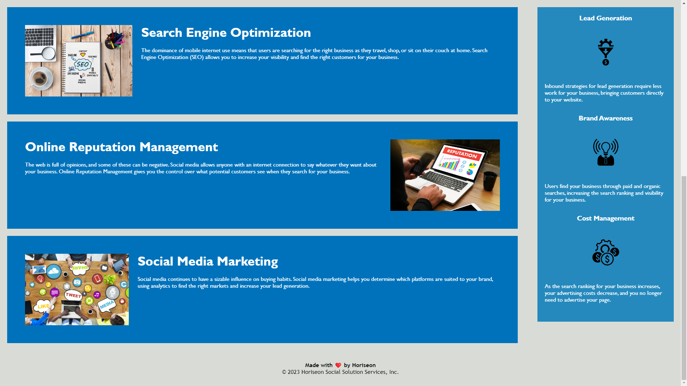

# Horiseon-Refactor

## Description
Order is vital to establish a healthy flow or prevent chaos. The Horiseon Social Solution Services webpage originally lacked order and flow, as it was cluttered with non-semantic HTML elements, unordered headers, broken image links, and was missing a title for web browsers. After minor adjustments to HTML structure, and with the addition of a title, the Horiseon Social Solution Services webpage is a fully accessible site with navigation and easy read code. 

### Challenges
Challenges occurred with organizing sequential header order. As a footer element contained an unordered header with unnecessary properties. The footer was adjusted to follow the order of the code, while not causing major alterations the website’s original format. 

#### Concluding statement
Overall, the Horiseon Social Solution Services website is readily available across all devices and browser platforms, and may receive content upgrades in the near future. 

##### Usage
To use the Horiseon Social Solution Services website, start by selecting one of the service topics at the top-right of the page such as Search Engine Optimization, Online Reputation Management, or Social Media Marketing and you will taken to a description of the selected service.

